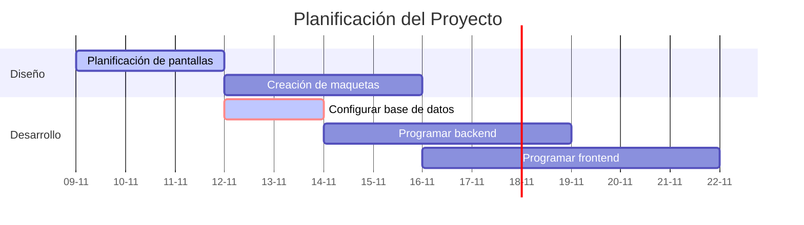

```mermaid
gantt
    title Planificación del Proyecto
    dateFormat  YYYY-MM-DD
    axisFormat  %d-%m
    
    section Diseño
    Planificación de pantallas :active, des1, 2026-11-09, 3d
    Creación de maquetas       : des2, after des1, 4d
    
    section Desarrollo
    Configurar base de datos   :crit, active, dev1, 2026-11-12, 2d
    Programar backend          : dev2, after dev1, 5d
    Programar frontend         : dev3, after des2, 6d
```
